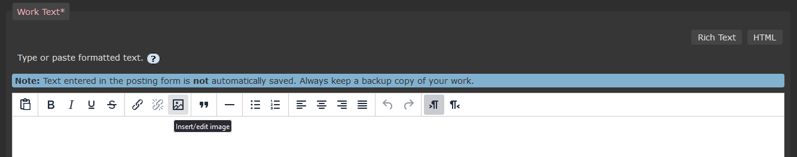
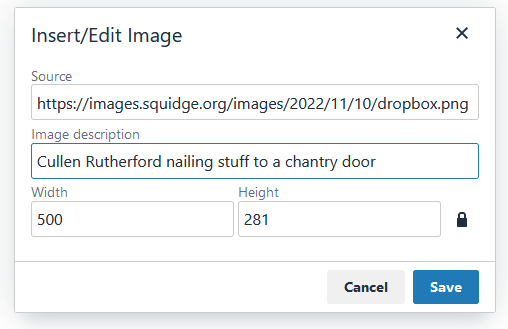

import { Steps } from "@astrojs/starlight/components";

Although AO3 does not host image files, fanart is welcome and encouraged to be
posted on the site! Posting fanart used to be more complicated, as it wasn't
optimized for mobile, so viewing images on tablets or art on works which did not
have a site skin caused them to be oversized. This was fixed by AO3 in Jan 2021!

<Steps>

1. Upload your art to another host. I highly recommend
   [Squidge Image](https://images.squidge.org/) for fandom image hosting. They
   are NSFW friendly and have generous file size limits!

2. Click `New Work`.

3. Enter required fields, such as rating, warnings, title, etc. Be sure to tag
   appropriately!

4. Under `Work Text`, click the `Rich Text` button.
   

5. Click the `Insert/Edit Image` button.
   

6. Complete the form that pops up.

   - _Source:_ a direct image url. be sure it ends in the file type! (i.e.
     `.png`, `.jpg`)
   - _Image Description:_ alternate text/image id for the image, used by screen
     readers and other accessibility tools.
   - _Size:_ prefills! You can change this if the default size of your image is
     larger than you want it to be.
     

7. Click `Save`.

</Steps>
