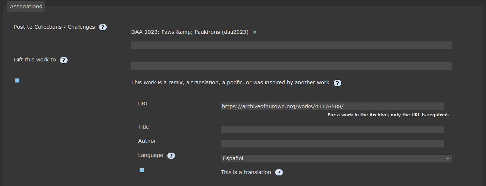
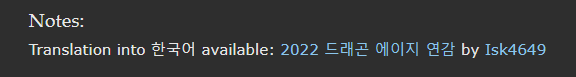

import { Steps } from "@astrojs/starlight/components";

<Steps>

1. Create a `New Work`.

2. Under _Associations_ click the
   `This work is a remix, a translation, a podfic, or was inspired by another work`
   checkbox.

3. Enter the URL for the work on AO3 and select the language in the dropdown
   box. If the work is not on AO3, list the URL, Title, and Author name.
   

4. Finish Posting. An email will be sent to the creator so they can confirm the
   link.

</Steps>

## Confirm the Link

<Steps>

1. From the email received click the link provided or go to your AO3 Dashboard
   and click _Related Works_.

2. Click Confirm.

3. AO3 automatically adds a Note to each work linking the two!
   

</Steps>
