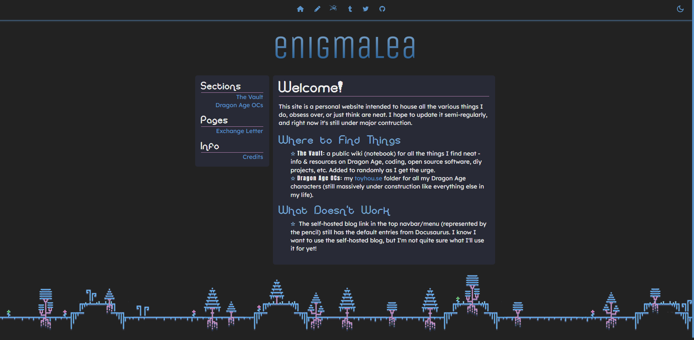

<figure>

<figcaption>Say good-bye to this design</figcaption>

</figure>

This is my first "major" update to the site update since switching to Docusaurus
and having more than a placeholder page. Although liking the initial design a
ton, I grew tired of it pretty quickly. I'm still not sure I like what i have
currently - it's _better_, but I'm not sure I'm ready to live with it for a
while. The first round of "major changes" include:

<!--truncate-->

- **updated almost every font on the site.**

  I really liked the quirky "pixel" design of the main header font, but I felt
  it could be difficult to read sometimes. The different font for `strong` and
  `b` tags was also difficult to read. After staring at it in frustration for
  too long, I finally took the chance to update the fonts.

- **eliminated title bottom borders and adjusting spacing.**
- **eliminated the footer background.**

  I'm looking for something to replace it, but I'm not sure what yet.

- **added my new "mascot".**

  That's me, enigmalea, hanging down in the bottom right corner of my page. I
  commissioned <a href="https://ko-fi.com/KiingFluffybuns">KiingFluffybuns</a>
  for an avatar/pagedoll and **love** what she designed for me. Y'all I threw a
  three page word doc with very few references at her and got this adorable art
  to represent me. I couldn't be happier. You can see the full size
  <a href="https://twitter.com/enigmaleaDA/status/1536787197231255555?s=20&t=KznHSdLRPlEQLOkc7Sv6vg">here</a>.

- **updated to the newest Docusaurus version, which allowed me to:**
  - offer hideable sidebars on the Vault.
  - enable breadcrumbs on the Vault.
- **added an automatic deploy to neocities from github.**
- **tweaked some CSS. The sidebar is now the same height as the main content of
  the page, which I think brings the pages some uniformity.**

I still have some CSS I'd like to tweak here and there; I'm not really in love
with the color scheme, among other things. The github repo for the site has been
updated to public, and you can see my thoughts and plans for the site by
[checking out the issues](https://github.com/enigmalea/enigmalea/issues).
