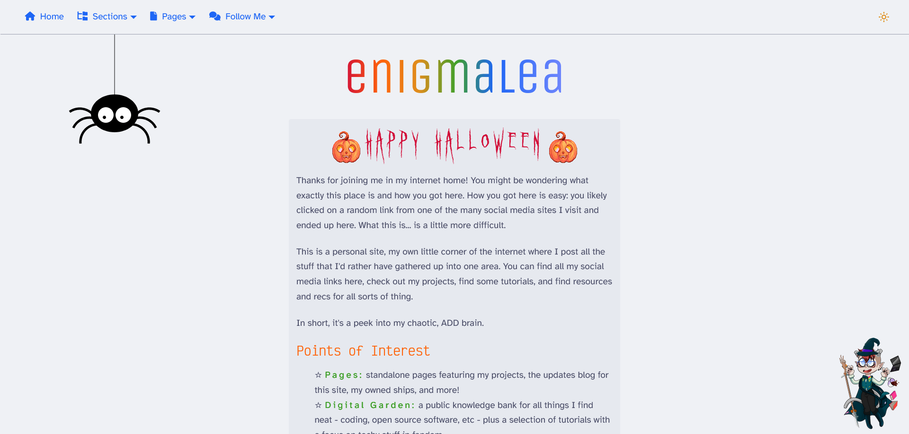
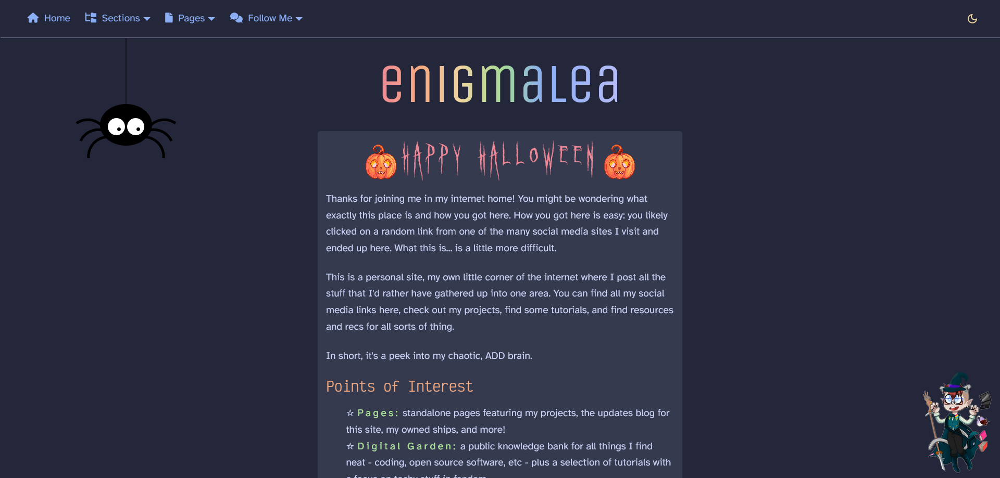

For the first time ever, [Fandom Coders](https://fancoders.com) decided to host
a themed Personal Website Club day, where we decorated our websites for
spooky/Halloween and Fall (or Spring for Southern Hemisphere). It was actually
my idea, so of course, I participated.

I didn't do a full theme update, but I did add some Halloween elements. You can
find screenshots of the updates and resources below the Read More...

<!-- truncate -->

## Screenshots

## Resources

- [CSS Spider by ApeWare - Codepen](https://codepen.io/ApeWare/pen/LgXRGG)

  Codepen is a great resource for code snippets, and I found this little
  animated spider while looking for Halloween themed pens. I edited it slightly
  by making the web black (it worked better for my light theme that way). Since
  it was fairly large and animated, I made sure to hide it on smaller mobile
  screens and for those who prefer reduced motion.

- [Header Pumpkin Graphic by Rosemary](https://hillhouse.neocities.org/pixels)

  I stumbled on this website looking for graphic resources on neocities. The
  adorable pumpkin had to make its way into my site update.

- [Header Font: Ghastly Panic by Sinister Fonts - DaFont](https://www.1001fonts.com/ghastly-panic-font.html)

- [HR Divider Image](https://pixel-soup.tumblr.com/post/165823458905/halloween-bordersbanners)

  I added a cute little HR divider image of ghosts, bats, and pumpkins. I did
  use photopea to create a no motion version for visitors who use reduced motion
  settings.

- [Witch's Hat by Freepik](https://www.freepik.com/free-vector/halloween-witch-hat-collection_3114359.htm)

  You might have notice I added a ~~poorly photoshopped on~~ witch hat to my
  mascot who hangs out in the bottom corner. I also changed up the colors to
  match my mascot's outfit a little better. The link above is where you can find
  the vector image.

- [Boo Cursor](https://www.cursors-4u.com/cursor/2011/01/27/boo-set.html)

  And last but not least, I've added a custom Mario Bros Boo cursor. The cursors
  above had to be converted to pngs before they'd work in browser, but that was
  relatively easy to do!

I might continue adding spoopy season things throughout October as I go. This
was a ton of fun!
